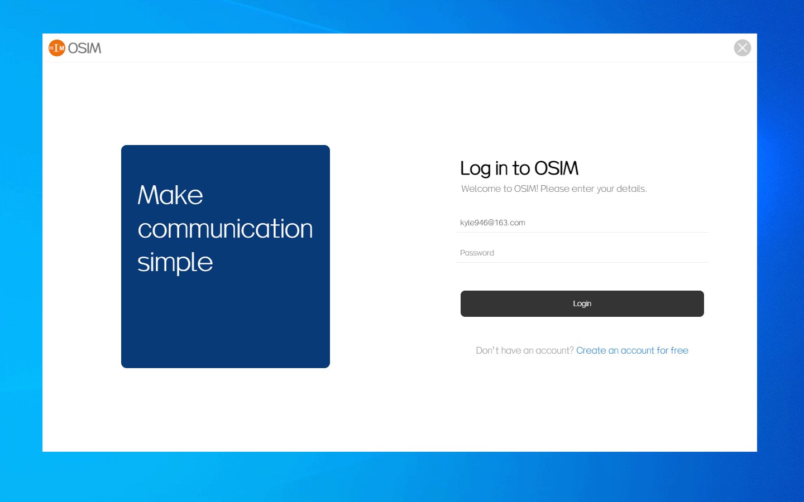

## OSIM聊天软件

 

开发文档、使用手册地址：https://app.yixinu.com/osim/manual/

 

### OSIM是什么？

OSIM是一款 **免费开源** 的即时通讯系统 ；
系统轻便简单，没有其他IM产品那么多复杂的东西，上手也简单；
服务端和PC客户端都是用 JavaScript 语言开发，做二次开发也非常方便，哪怕是新手纯前端工程师也没有问题；

 

### OSIM的特点
1. 免费开源；
2. 界面简洁美观；
3. 部署简单、开发容易；
4. 使用 JavaScript 语言开发，只要懂js即可，哪怕你是一个纯前端工程师；
5. 可以很方便的扩展功能 ；
6. 使用electron框架 ，可跨平台；

 
 

### 重点说明

**1、开发用了多长时间？**

整个系统从0开始设计、框架技术、表设计缓存、前后端开发、测试BUG修复，**只用了8天的时间**，

所以如果发现系统里面有BUG或者缺少的功能，不要见怪   ^_^   。

 

**2、为什么功能这么简单？**

该版本仅支持IM的基本功能，架构也非常简单，开始开发的时候就是想**自己拿来玩的**，没想要做很多复杂的功能。

需要更丰富的功能 、更稳定的版本，请联系作者。

 

**3、有没有更加丰富商业版？**

有，商业版的架构、功能、所用的技术和这个完全不一样，商业版的后端使用C++开发。

 

**4、这个免费的开源版还会不会更新？**

会，后面还会完善一些功能，并且还会做一个移动端。

##### 需要更丰富的功能 、更稳定的版本，请联系作者。

 
 

### 联系作者

Email：kyle946@163.com

微信：xianglou

来信请说明咨询OSIM。

